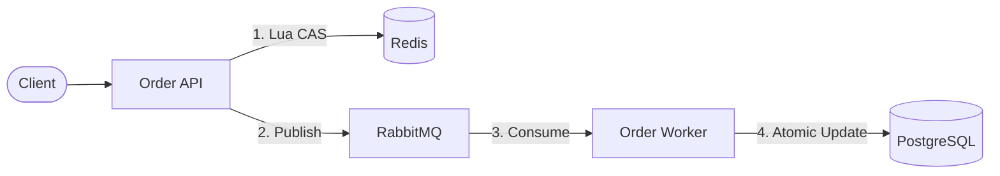
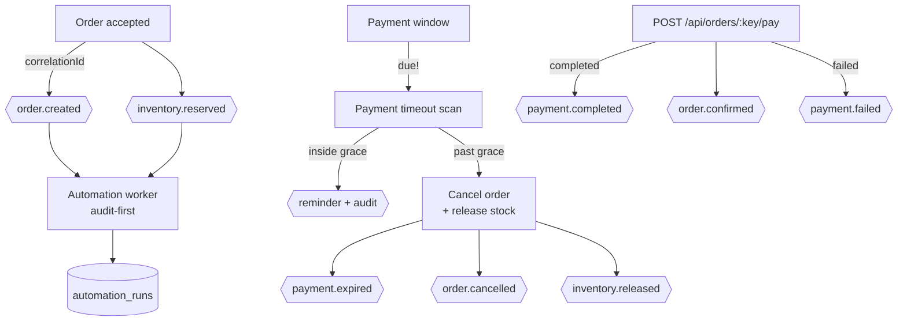

# Flash-Sale Reliability Platform

[](https://dotnet.microsoft.com/)
[](https://postgresql.org/)
[](https://redis.io/)
[](https://rabbitmq.com/)

A portfolio-grade, event-driven backend built to handle high-concurrency "flash sale" scenarios. The core engineering challenge is processing thousands of simultaneous purchase attempts for limited inventory without overselling, while keeping latency low and the database healthy.

## 📖 The Business Problem & Engineering Solution

During a flash sale, inventory is strictly limited (e.g., 10 items). A naive synchronous approach falls apart under concurrent load, leading to race conditions (overselling) and database timeouts.

**The Solution:**
- **Redis Lua CAS (Compare-And-Swap):** Fast, atomic inventory reservations at the cache layer to act as an immediate gatekeeper, returning fast-fails for excess traffic.
- **RabbitMQ (At-least-once delivery):** Buffers valid requests into an async queue, protecting the primary database from load spikes.
- **PostgreSQL (Authoritative Truth):** Handles the final atomic conditional `UPDATE`, ensuring absolute data consistency.

## 🚀 Key Achievements & Evidence
*These metrics were validated using real `Testcontainers` infrastructure and `k6` load testing, not fabricated.*

- **Zero Overselling Invariant:** 50 concurrent purchase attempts against a stock of 10 produced exactly 10 persisted sales and a final stock of 0.
- **High Performance:** Achieved a **p95 latency of 29ms** during peak flash-sale concurrency (compared to 574ms in the naive synchronous iteration).
- **Idempotency & Resiliency:** Verified Redis failure fallbacks, RabbitMQ `ack-after-persist` behaviors, and safe retry mechanisms for duplicate/failed requests.
- **Disaster Recovery:** Automated PostgreSQL backup and clean-restore procedures using `pg_dump -Fc` with SHA-256 verification and application smoke testing against the recovered DB.

## 🏗️ Architecture



## 🤖 Automation Platform (Business Automation Spec)

Event-driven automation layered on the same order path — no core transactional
logic was moved, and the pre-automation HTTP contract is unchanged.



### Implemented workflows

| Workflow | Trigger | Condition | Action | Failure path | Retry | Audit | Human approval |
|---|---|---|---|---|---|---|---|
| Order events (spec §4) | order accept + worker persist | always | publish `order.created` / `inventory.reserved` | best-effort publish, order stays valid | queue retry ×4 → DLQ | `automation_runs` (worker) | no |
| Payment timeout (spec §5) | timer (`PaymentTimeoutHostedService`) or `POST /internal/automation/payment-timeout-scan` | `PendingPayment` & past due → remind; past due+grace → cancel | reminder counter; cancel + DB stock release + Redis mirror | guarded UPDATE ⇒ no-op on replay; publish best-effort | bounded scan batch (200) | 1 run per scan (`Success`/`Failed`) | no |
| Payment recording (spec §4) | `POST /api/orders/{key}/pay` | order is `PendingPayment` | `completed` ⇒ `Confirmed`; `failed` ⇒ stays pending | second call ⇒ 409 (status guard) | n/a (idempotent) | 1 run per call | simulated gateway — no real processor |
| Low-stock alert (spec §6) | timer (`LowStockScanHostedService`) or `POST /internal/automation/low-stock-scan` | `AvailableStock <= ReorderThreshold` (inclusive) | create deduplicated Open `StockAlerts` row + publish `inventory.low_stock` | rule re-checked in-process; duplicate insert rejected by partial unique index ⇒ reported as deduped | periodic rescan | 1 run per scan (`InventoryAutomation`) | no — advisory only, stock numbers never come from AI |
| Daily report (spec §7) | timer (`DailyReportHostedService`, `RunAtHourUtc`) or `POST /internal/automation/daily-report` | every report day (UTC window) | aggregate orders/revenue/failed payments/cancellations/top products/low stock from PostgreSQL → persist one `DailyReports` row (rerun upserts) | run recorded `Failed`, row untouched | rerun recomputes the day | 1 run per generation (`DailyReport`) | no — all numbers are DB aggregates; AI summary NOT implemented (PLANNED) |

### Configuration (never hard-coded — spec §5)

| Key | Default | Meaning |
|---|---|---|
| `Automation:Payment:TimeoutMinutes` | 15 | payment window per order |
| `Automation:Payment:GracePeriodMinutes` | 15 | extra time before cancellation |
| `Automation:Payment:MaxPaymentReminders` | 3 | reminder cap per order |
| `Automation:Payment:ScanIntervalSeconds` | 60 | timer scan cadence (worker) |
| `Automation:Inventory:DefaultReorderThreshold` | 5 | fallback reorder point (product value wins when > 0) |
| `Automation:Inventory:ScanIntervalSeconds` | 60 | low-stock scan cadence (worker) |
| `Automation:Reporting:RunAtHourUtc` | 0 | UTC hour the daily report fires |
| `Automation:Reporting:ScanIntervalSeconds` | 300 | how often the scheduler checks the hour |
| `Automation:Reporting:TopProductCount` | 5 | rows in the top-products ranking |

### Demo — scenario A (timeout → remind → cancel → release → audit)

```bash
# 1) place an order, then walk it through the payment lifecycle
curl -X POST localhost:5099/api/orders -H 'Idempotency-Key: demo-1' \
     -H 'Content-Type: application/json' -d '{"productId":1,"quantity":1}'
curl -X POST localhost:5099/api/orders/demo-1/pay \
     -H 'Content-Type: application/json' -d '{"outcome":"completed"}'   # → confirmed
curl -X POST localhost:5099/api/orders/demo-1/pay \
     -H 'Content-Type: application/json' -d '{"outcome":"completed"}'   # → 409 (guarded)

# 2) run the abandoned-payment scan (same use case the timer runs)
curl -X POST localhost:5099/internal/automation/payment-timeout-scan
#    grace elapsed ⇒ {"scanned":N,"reminded":0,"cancelled":N}, stock restored

# 3) audit trail
docker exec <postgres> psql -U postgres -d FlashSaleDb -c \
  'SELECT "WorkflowName","TriggerType","Status","ResultSummary" FROM "AutomationRuns" ORDER BY "Id" DESC LIMIT 5;'
```

*Verified locally: 21/21 live smoke checks (`/tmp`-style script), 82 unit +
24 integration tests green, and the v1.0 auth/order smoke (48 checks) still
passes — the legacy `GET /api/orders/{key}` wording (`processing|completed`)
was deliberately left untouched.*

## 📂 Project Structure (Clean Architecture)
```text
src/
├── FlashSale.Domain/         # Entities, Value Objects, Exceptions (No external dependencies)
├── FlashSale.Application/    # Use Cases & Ports (Interfaces)
├── FlashSale.Infrastructure/ # Adapters (EF Core, Redis, RabbitMQ)
├── Order.Api/                # Presentation Layer (API endpoints)
└── Order.Worker/             # Background processing daemon
tests/
└── UnitTests/                # Includes Architecture Tests (enforcing layer boundaries)
```
