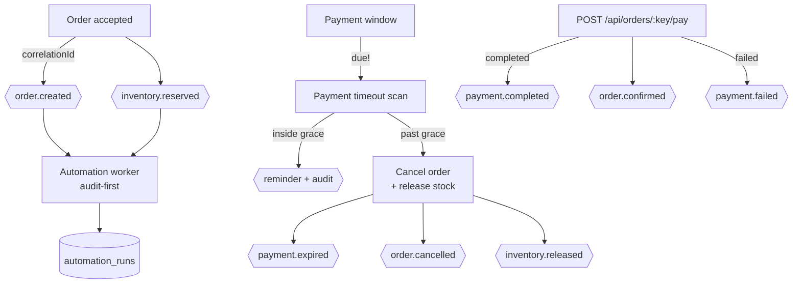

# Flash-Sale Reliability Platform

[](https://dotnet.microsoft.com/)
[](https://postgresql.org/)
[](https://redis.io/)
[](https://rabbitmq.com/)

A portfolio-grade, event-driven backend built to handle high-concurrency "flash sale" scenarios. The core engineering challenge is processing thousands of simultaneous purchase attempts for limited inventory without overselling, while keeping latency low and the database healthy.

> **Role:** Backend Engineer (C# / .NET 10, PostgreSQL, Redis, RabbitMQ).
> **One-liner for HR:** I built an order system where 50 buyers race for 10 items — exactly 10 sales succeed, 40 get honest fast-fails. That invariant is re-checked on every CI run (the `concurrency-harness` job fails the build unless the harness prints `RESULT: PASS`); the latency figures quoted below are single local runs, not a CI gate.
> **For Tech Lead:** Clean Architecture (Domain <- Application <- Infrastructure <- Api/Worker) with dependency-direction guards in `tests/UnitTests/ArchitectureTests.cs`. Evidence in `docs/benchmarks/` + `docs/adr/001-005`.

## 🧠 Skills Demonstrated (scan in 30s)

| Area | What I did | Where to verify |
|---|---|---|
| Concurrency control | Redis Lua CAS gatekeeper + PG atomic conditional `UPDATE` | `docs/adr/002-003-*`, `docs/benchmarks/phase2-005-*` |
| Async / resilience | RabbitMQ at-least-once, ack-after-persist, DLQ, idempotency keys | `docs/adr/004-005-*`, `src/Order.Worker/` |
| Data integrity | Zero-oversell invariant: 50 req / stock 10 → 10 sales, stock 0 | `docs/benchmarks/phase2-oversell-experiment.md` |
| Performance | Local single run: p95 29ms tiered vs 574ms naive sync; pool cap 80/100 to keep operator headroom. Not a CI gate — re-measure before quoting | `docs/benchmarks/phase4-highload-experiment.md`, `phase5-tiered-experiment.md` |
| Authorization | `StaffOrAdmin` closed every ops endpoint; a source-level guard fails the build if a route is mapped without a policy | `tests/UnitTests/EndpointAuthorizationGuardTests.cs`, `tests/IntegrationTests/EndpointAuthorizationTests.cs` |
| Operability | pg_dump -Fc backup + SHA-256 + restore smoke test | `docs/adr/008-009-*` |
| Architecture discipline | Port + adapter for every infra addition; thin `Program.cs` | `src/FlashSale.Application/`, `tests/UnitTests/ArchitectureTests.cs` |

## 🔍 Problem → Decision → Tradeoff (how I think)

1. **Naive sync oversells under race** → reproduced first (`docs/benchmarks/phase2-*`), then fixed with atomic conditional UPDATE. Tradeoff: hot-row lock queues (p95 574ms at 200 conc. in one local run) — accepted as correctness baseline.
2. **90% wasted DB round-trips just to say "no"** → Redis Lua CAS pre-filter (single RTT, atomic). Tradeoff: cache/DB divergence risk — mitigated by PG as authoritative truth + Redis mirror on cancel path.
3. **Traffic spikes kill DB** → RabbitMQ buffer + worker persist + ack-after-persist. Tradeoff: at-least-once duplicates — mitigated by idempotency keys + guarded UPDATEs.
4. **Pool saturation locks out operators** → cap API pool 80 < server 100. Small fix, big SRE lesson: always leave headroom.

## 📖 The Business Problem & Engineering Solution

During a flash sale, inventory is strictly limited (e.g., 10 items). A naive synchronous approach falls apart under concurrent load, leading to race conditions (overselling) and database timeouts.

**The Solution:**
- **Redis Lua CAS (Compare-And-Swap):** Fast, atomic inventory reservations at the cache layer to act as an immediate gatekeeper, returning fast-fails for excess traffic.
- **RabbitMQ (At-least-once delivery):** Buffers valid requests into an async queue, protecting the primary database from load spikes.
- **PostgreSQL (Authoritative Truth):** Handles the final atomic conditional `UPDATE`, ensuring absolute data consistency.

## 🚀 Key Achievements & Evidence

**The claim CI actually enforces: the zero-oversell invariant.** Every push runs
`.github/workflows/ci.yml` → job `concurrency-harness`, which fires 50 concurrent
purchase attempts at a stock of 10 through
`load-tests/concurrency/oversell_demo.py` and then **fails the job unless the
output contains `RESULT: PASS`**. `RESULT: PASS` means the database audit agrees
exactly: 10 sales persisted, final stock 0, and `accepted + rejected == 50` with no
lost responses. Reproduce it locally with the same command the job runs.

Everything below that is a latency number is a **local single-run observation** from
the `docs/benchmarks/` experiments, not a CI gate and not a promise. Re-measure
before quoting one.

- **Zero Overselling Invariant (CI-enforced):** 50 concurrent purchase attempts
  against a stock of 10 → exactly 10 persisted sales, final stock 0. Checked on
  every CI run; see above.
- **Latency (local single run, not reproducible in CI):** p95 **29 ms** for the
  tiered path versus **574 ms** for the naive synchronous iteration. Host- and
  load-dependent; the numbers of record live in `docs/benchmarks/`.
- **Idempotency & Resiliency:** Verified Redis failure fallbacks, RabbitMQ `ack-after-persist` behaviors, and safe retry mechanisms for duplicate/failed requests.
- **Disaster Recovery:** Automated PostgreSQL backup and clean-restore procedures using `pg_dump -Fc` with SHA-256 verification and application smoke testing against the recovered DB.

### Test suite (verified locally, `-c Release`)

| Suite | Count | Command |
|---|---|---|
| Unit (use cases, architecture + authorization guards) | **148** | `dotnet test tests/UnitTests/FlashSale.UnitTests.csproj -c Release` |
| Integration (Testcontainers: real Postgres + Redis + RabbitMQ) | **60** | `dotnet test tests/IntegrationTests/FlashSale.IntegrationTests.csproj -c Release` |

### 🔐 Authorization model (ADR-013 §5)

Roles are a closed set — `CUSTOMER`, `STAFF`, `ADMIN` — and they are **never chosen
by the caller**:

- `POST /api/auth/register` always creates a `CUSTOMER`. A `{"role":"ADMIN"}` in the
  body is ignored, and `RegisterRequest` has no role member for it to bind to.
- `/internal/**`, `/api/outbox/**` and `POST /api/inbox/consume` require
  `StaffOrAdmin`. `POST /api/inbox/consume` is deliberately staff-only rather than
  merely authenticated: it writes the deduplication ledger the real consumers read,
  so an ordinary caller could make a genuine delivery be silently skipped.
- `POST /api/orders/{key}/pay` and `GET /api/orders/{key}` require an authenticated
  caller **and** ownership: the order's `UserId` must equal the token's `sub`, or
  the caller must be Staff/Admin. An anonymous order is owned by nobody, so only
  Staff/Admin can poll or settle it.
- `POST /api/saga/checkout` requires any authenticated caller — it is the customer
  checkout path and it already attributes the saga to the caller's `sub`.
- `POST /api/orders` is **intentionally anonymous** (ADR-013 §6) — the zero-oversell
  evidence above depends on unauthenticated buyers. `/api/products/{id}` and the
  `/health*` probes are intentionally public too.

`tests/UnitTests/EndpointAuthorizationGuardTests.cs` enforces this from the source: a
route that is mapped without `RequireAuthorization()` and is not on the
documented public allowlist fails the build, so the hole cannot silently reopen.

#### Bootstrap: how the first ADMIN and STAFF accounts come into existence

There is no self-service promotion, and no credential in the repository. Two
opt-in environment variables (never committed — supply them from a secret store):

| Variable | Effect when set | When unset |
|---|---|---|
| `Bootstrap:AdminToken` (env `Bootstrap__AdminToken`) | Enables `POST /api/auth/bootstrap`. Present the secret in the `X-Bootstrap-Token` header to create the initial `ADMIN` (403 on a wrong secret). | The endpoint does not exist (**404**) and no ADMIN can be created. A warning is logged at startup either way. |
| `Bootstrap:StaffPassword` (env `Bootstrap__StaffPassword`) | Seeds the `STAFF` account (`staff@flashsale.local`) on first boot **only**. An existing account is left untouched — no re-hash, no role reset. | No STAFF account is created; the `/internal/**` runbook endpoints are unreachable without a bootstrap admin. |

Run the bootstrap once, then unset `Bootstrap:AdminToken`:

```bash
curl -X POST localhost:5099/api/auth/bootstrap \
  -H 'X-Bootstrap-Token: <Bootstrap:AdminToken>' -H 'Content-Type: application/json' \
  -d '{"email":"ops-admin@example.com","password":"<at least 10 characters>"}'
```

The bootstrap **creates and never promotes**: if the email is already registered it
returns 409 and the existing account keeps its role, so it cannot be used to seize
an address somebody else signed up with.

## 🏗️ Architecture


## 🤖 Automation Platform (Business Automation Spec)

Event-driven automation layered on the same order path — no core transactional
logic was moved, and the pre-automation HTTP contract is unchanged.



### Implemented workflows

| Workflow | Trigger | Condition | Action | Failure path | Retry | Audit | Human approval |
|---|---|---|---|---|---|---|---|
| Order events (spec §4) | order accept + worker persist | always | publish `order.created` / `inventory.reserved` | best-effort publish, order stays valid | queue retry ×4 → DLQ | `automation_runs` (worker) | no |
| Payment timeout (spec §5) | timer (`PaymentTimeoutHostedService`) or `POST /internal/automation/payment-timeout-scan` | `PendingPayment` & past due → remind; past due+grace → cancel | reminder counter; cancel + DB stock release + Redis mirror | guarded UPDATE ⇒ no-op on replay; publish best-effort | bounded scan batch (200) | 1 run per scan (`Success`/`Failed`) | no |
| Payment recording (spec §4) | `POST /api/orders/{key}/pay` | order is `PendingPayment` | `completed` ⇒ `Confirmed`; `failed` ⇒ stays pending | second call ⇒ 409 (status guard) | n/a (idempotent) | 1 run per call | simulated gateway — no real processor |
| Low-stock alert (spec §6) | timer (`LowStockScanHostedService`) or `POST /internal/automation/low-stock-scan` | `AvailableStock <= ReorderThreshold` (inclusive) | create deduplicated Open `StockAlerts` row + publish `inventory.low_stock` | rule re-checked in-process; duplicate insert rejected by partial unique index ⇒ reported as deduped | periodic rescan | 1 run per scan (`InventoryAutomation`) | no — advisory only, stock numbers never come from AI |
| Daily report (spec §7) | timer (`DailyReportHostedService`, `RunAtHourUtc`) or `POST /internal/automation/daily-report` | every report day (UTC window) | aggregate orders/revenue/failed payments/cancellations/top products/low stock from PostgreSQL → persist one `DailyReports` row (rerun upserts) | run recorded `Failed`, row untouched | rerun recomputes the day | 1 run per generation (`DailyReport`) | no — all numbers are DB aggregates; AI summary NOT implemented (PLANNED) |
| Automation dashboard (spec §14) | `GET /internal/automation/summary` + `GET /internal/automation/alerts` | on demand | runs today/success/failed/retrying/manual-review/avg duration/top failing workflow from `AutomationRuns`; open `StockAlerts` list | empty day → zeroed summary | n/a (read) | reads `AutomationRuns` | no |

### Configuration (never hard-coded — spec §5)

| Key | Default | Meaning |
|---|---|---|
| `Automation:Payment:TimeoutMinutes` | 15 | payment window per order |
| `Automation:Payment:GracePeriodMinutes` | 15 | extra time before cancellation |
| `Automation:Payment:MaxPaymentReminders` | 3 | reminder cap per order |
| `Automation:Payment:ScanIntervalSeconds` | 60 | timer scan cadence (worker) |
| `Automation:Inventory:DefaultReorderThreshold` | 5 | fallback reorder point (product value wins when > 0) |
| `Automation:Inventory:ScanIntervalSeconds` | 60 | low-stock scan cadence (worker) |
| `Automation:Reporting:RunAtHourUtc` | 0 | UTC hour the daily report fires |
| `Automation:Reporting:ScanIntervalSeconds` | 300 | how often the scheduler checks the hour |
| `Automation:Reporting:TopProductCount` | 5 | rows in the top-products ranking |

### Demo — scenario A (timeout → remind → cancel → release → audit)

```bash
# 0) get a caller token. The pay endpoint is owner-scoped, and the ops scans are
#    Staff/Admin, so the demo uses two identities.
CUSTOMER=$(curl -s -X POST localhost:5099/api/auth/register -H 'Content-Type: application/json' \
  -d '{"email":"demo-customer@example.com","password":"<at least 10 characters>"}' \
  | grep -o '"accessToken":"[^"]*' | cut -d'"' -f4)
STAFF=$(curl -s -X POST localhost:5099/api/auth/login -H 'Content-Type: application/json' \
  -d '{"email":"staff@flashsale.local","password":"<Bootstrap:StaffPassword>"}' \
  | grep -o '"accessToken":"[^"]*' | cut -d'"' -f4)

# 1) place an order, then walk it through the payment lifecycle
curl -X POST localhost:5099/api/orders -H 'Idempotency-Key: demo-1' \
     -H 'Content-Type: application/json' -d '{"productId":1,"quantity":1}'
curl -X POST localhost:5099/api/orders/demo-1/pay \
     -H "Authorization: Bearer $CUSTOMER" \
     -H 'Content-Type: application/json' -d '{"outcome":"completed"}'   # → confirmed
curl -X POST localhost:5099/api/orders/demo-1/pay \
     -H "Authorization: Bearer $CUSTOMER" \
     -H 'Content-Type: application/json' -d '{"outcome":"completed"}'   # → 409 (guarded)

# 2) run the abandoned-payment scan (same use case the timer runs) — Staff/Admin
curl -X POST localhost:5099/internal/automation/payment-timeout-scan \
     -H "Authorization: Bearer $STAFF"
#    grace elapsed ⇒ {"scanned":N,"reminded":0,"cancelled":N}, stock restored

# 3) audit trail
docker exec <postgres> psql -U postgres -d FlashSaleDb -c \
  'SELECT "WorkflowName","TriggerType","Status","ResultSummary" FROM "AutomationRuns" ORDER BY "Id" DESC LIMIT 5;'
```

*Verified locally: 148 unit + 60 integration tests green, and the live smoke
scripts still pass. The legacy `GET /api/orders/{key}` wording
(`processing|completed`) was deliberately left untouched — only its authorization
changed (authenticated + owner-scoped).*

## 📂 Project Structure (Clean Architecture)
```text
src/
├── FlashSale.Domain/         # Entities, Value Objects, Exceptions (No external dependencies)
├── FlashSale.Application/    # Use Cases & Ports (Interfaces)
├── FlashSale.Infrastructure/ # Adapters (EF Core, Redis, RabbitMQ)
├── Order.Api/                # Presentation Layer (API endpoints)
└── Order.Worker/             # Background processing daemon
tests/
└── UnitTests/                # Includes Architecture Tests (enforcing layer boundaries)
```
