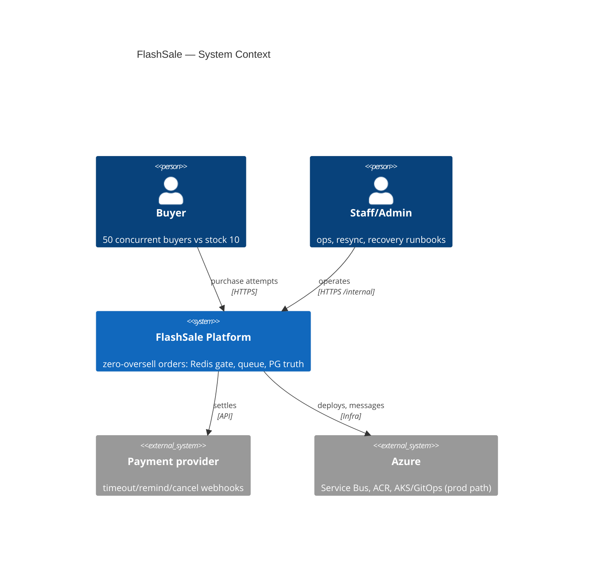
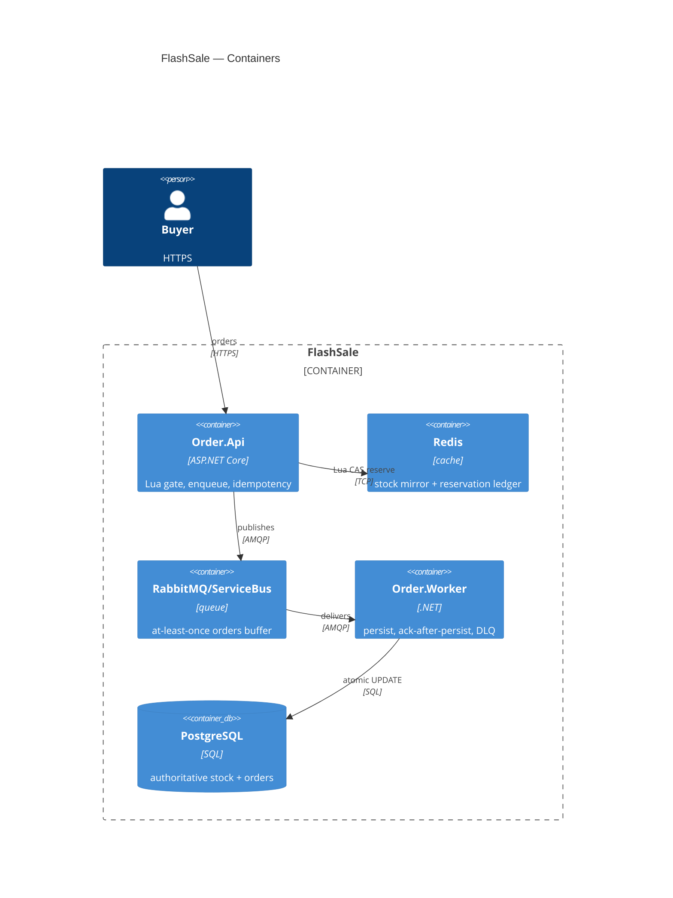

# FlashSale-Backend — C4 Architecture

> Source of truth: repo README + `docs/architecture/current-architecture.md`
> + ADRs 001–005. Flow: API → Redis Lua gatekeeper → RabbitMQ → worker → PG
> truth; v2 LOCAL runs the same saga on kind/Kafka (see `docs/EVIDENCE.md` §5).

## C4-Context

## C4-Container

